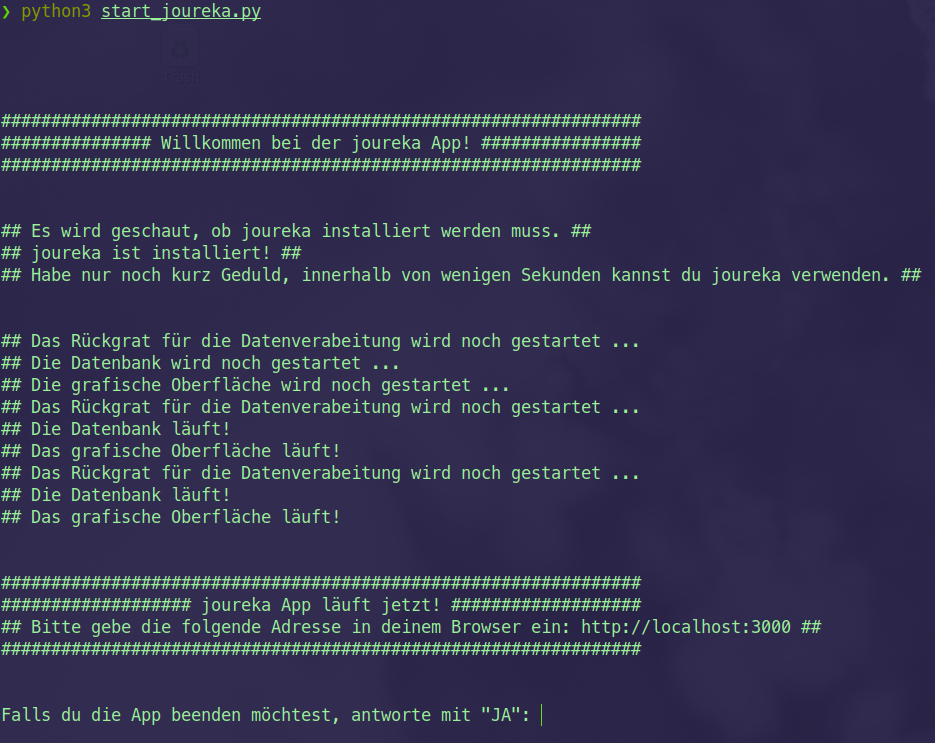

# joureka - Mit mehr Muße vom Interview zum Artikel!

## Was ist joureka?
joureka macht die Arbeit von Journalist:innen leichter! Mit joureka transkribierst Du Deine Interviews automatisch und bereitest Deine Artikel vor: joureka bietet generierte Überblicke über die Textinhalte der Aufnahmen. Die Entwicklung von joureka wurde durch den Prototype Fund, das Deutsche Zentrum für Luft- und Raumfahrt sowie das Bundesministerium für Bildung und Forschung gefördert. Desweiteren entspringt joureka dem aureka-Ökosystems. [aureka](https://aureka.ai) ist ein Startup, das digitale Tools für den Erhalt von audiovisuellem Erbe und der Wissensproduktion entwickelt.  

## Installationsanleitung für Journalist*innen

Da joureka lediglich begrenzt finanziert ist, setzt die Installation ein wenig digitale Handwerklichkeit vorraus. Um die Installation durchzuführen, solltest Du schon einmal von Kommandozeile, Git, Docker und Python gehört haben. Alles weitere läuft im Hintergrund und automatisiert. 
Wir nehmen Dich so gut es geht an die Hand und erklären jeden einzelnen Schritt im Detail! 

Was sind die Voraussetzungen für die Installation? Dein Rechner sollte eine der drei Betriebssystem verwenden Windows 10, Max OS X und Ubuntu 20.04. und im Optimalfall - nicht zwingend - jünger als 3 Jahre sein.
Wie bereits erwähnt benötigst Du für die Installation Git, Docker und Python!

### Übersicht der Installation

Dies sind die Schritte, welche Du durchführen wirst: 

1. [Git installieren](#git-installieren)
2. [Python installieren](#python-installieren)
3. [Docker installieren](#docker-installieren)
4. [Kommandozeile öffnen](#kommandozeile-öffnen)
5. [Kopieren der joureka-Dateien](#kopieren-der-joureka-dateien)
6. [Installieren und starten der joureka App](#installieren-und-starten-der-joureka-app)


#### **Git installieren**

Git ist ein Tool für die Verwaltung von Code. Du benötigst es, um den Quellcode von joureka zu beziehen.

Windows 10
> Git installieren: \
> [Deutsche Anleitung auf Heise.de](https://www.heise.de/tipps-tricks/Git-auf-Windows-installieren-und-einrichten-5046134.html#Kurzanleitung)


Mac OS X
> Git installieren - siehe Unterpunkt "Installation unter macOS": \
> [Deutsche Anleitung der Git Webseite](https://git-scm.com/book/de/v2/Erste-Schritte-Git-installieren)


Ubuntu 20.04.
> Git installieren - siehe Unterpunkt "Installation unter Linux": \
> [Deutsche Anleitung der Git Webseite](https://git-scm.com/book/de/v2/Erste-Schritte-Git-installieren)


#### **Python installieren**

Die Installation von joureka auf Deinem Recher wird mittels Python durchgeführt.
Für alle Plattformen kann Python heruntergeladen werden - wichtig ist, dass es eine Python 3 Version ist.
> [Python herunterladen](https://www.python.org/downloads/)

Windows 10
> [Deutsche Installationsanleitung via Blog](https://bodo-schoenfeld.de/installation-von-python-unter-windows-10/)

Mac OS X
> [Deutsche Anleitung via Blog](https://www.davidkehr.com/python-3-auf-dem-mac-installieren/)


Ubuntu 20.04.
> Git installieren - siehe Unterpunkt "installation unter macOS": \
> [Deutsche Anleitung via Blog](https://technoguru.istocks.club/so-installieren-sie-python-in-ubuntu/2021-02-03/)

#### **Docker installieren**

Docker wird die Installation auf Deinem Rechner in sogenannten Containern verwalten.

Windows 10
> Für die Verwendung von Docker auf Windows ist auch das Windows Subsystem for Linux 2 (WSL 2) nötig: \
> [Anleitung für die Installation von Docker](https://docs.docker.com/desktop/windows/install/) \
> [Deutsche Anleitung für die Installation von WSL 2](https://docs.microsoft.com/de-de/windows/wsl/install)

Mac OS X
> [Anleitung für die Installation von Docker](https://docs.docker.com/desktop/mac/install/)


Ubuntu 20.04.
> Für die Verwendung von joureka ist Docker und Docker-Compose nötig: \
> [Anleitung für die Installation von Docker](https://docs.docker.com/engine/install/ubuntu/) \
> [Anleitung für die Installation von Docker Compose - unter Reiter Linux](https://docs.docker.com/compose/install/)

Super, falls diese Sachen jetzt auf Deinem Rechner laufen, können wir weiter machen!

#### **Kommandozeile öffnen**

Jetzt geht es an's Eingemachte! Zuallererst solltest Du die Kommandozeile - auch genannt Terminal oder Shell - öffnen:

Windows 10
> 1. Windows Taste drücken  
> 2. "PowerShell" eingeben und Enter 

Mac OS X
> 1. Spotlight-Suche via "Command + Leertaste" öffnen
> 2. "Terminal" eingeben und Enter


Ubuntu 20.04.
> 1. Systemweite Suche öffnen 
> 2. "Terminal" eingeben und Enter \
>  \
> **Alternativ**: "Steuerung" + "Umschalttaste" + "t"

Jetzt kannst Du mittels Git die Dateien der joureka App auf Deinem Rechner kopieren!

#### **Kopieren der joureka-Dateien**

Das Kopieren der Dateien führst Du auf allen Plattformen durch das Eingeben des folgenden Befehles in die Kommandozeile aus:
```bash
 git clone https://github.com/joureka-ai/joureka-app.git
```

Die Dateien der joureka app befinden sich jetzt in Deinem Home-Ordner:

Dein Ordner auf Windows 10:
> C:/Users/Nutzer*innenname/joureka-app

Dein Ordner auf Mac OS X:
> /Users/Nutzer*innenname/joureka-app

Dein Ordner auf Ubuntu 20.04. :
> /home/Nutzer*innenname/joureka-app

Da alle nötigen Dateien auf Deinem Rechner nun vorhanden sind, kannst Du die Installation mittels Python und der Kommandozeile starten.

Dafür musst Du in der offenen Kommandozeile in den "joureka-app" Ordner gehen.

Auf allen Plattformen in die Kommandozeile eingeben:
```bash
 cd joureka-app
```

Als nächstes kannst Du joureka installieren!

#### **Installieren und starten der joureka App**
Nun kannst Du die joureka App mittels eines Befehls installieren bzw. starten:

```bash
python start_joureka.py
```

Jetzt startet die Installation, dies wird eine Weile dauern. Je nachdem wie alt dein Rechner ist und wie schnell dein Internet kann dies unter Umständen bis zu 1,5 h dauern.

Nach der einmaligen Installation kannst Du den gleichen Befehl verwenden, um joureka als App zu starten.

Wenn die App gestartet ist, wird das folgende in Deiner Kommandozeile angezeigt:

